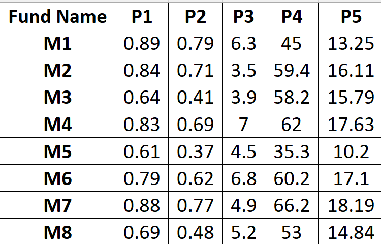

# TOPSIS Implementation in Python

This Python package implements the Technique for Order Preference by Similarity to Ideal Solution (TOPSIS). It ranks alternatives based on multiple criteria while considering their weights (importance) and impacts (benefit or cost).

## Features

- **Input Validation**: Ensures the dataset, weights, and impacts are correctly formatted.
- **Error Handling**: Handles invalid data, incorrect parameters, and file-related issues gracefully.
- **Outputs**: Generates a CSV file with scores, rankings, and original data columns.

---

## How to Use

1. Clone the repository and navigate to the project directory.
2. Ensure Python is installed with the required libraries.
3. Run the program using the following command:
   ```bash
   python -m topsis_Navyaa_102203376.topsis <InputDataSet.csv> <Weights> <Impacts> <ResultFile.csv>

   ## Input dataset


## Weights used
[1,1,1,1,1]

## Impacts used
[0,1,1,0,1]
### 1 for benifit
### 0 for cost

## Output


